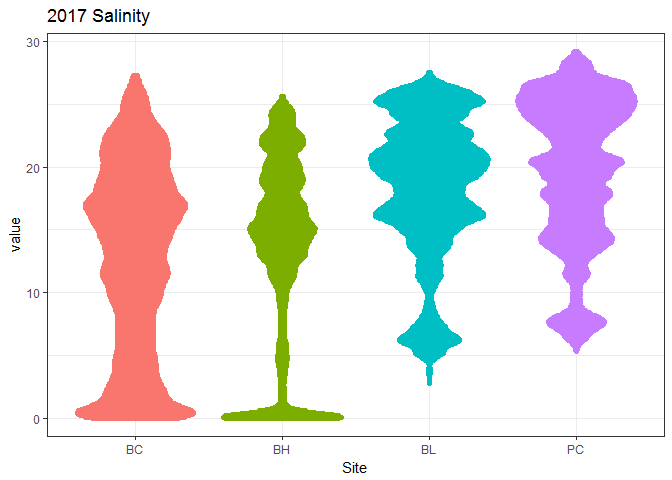
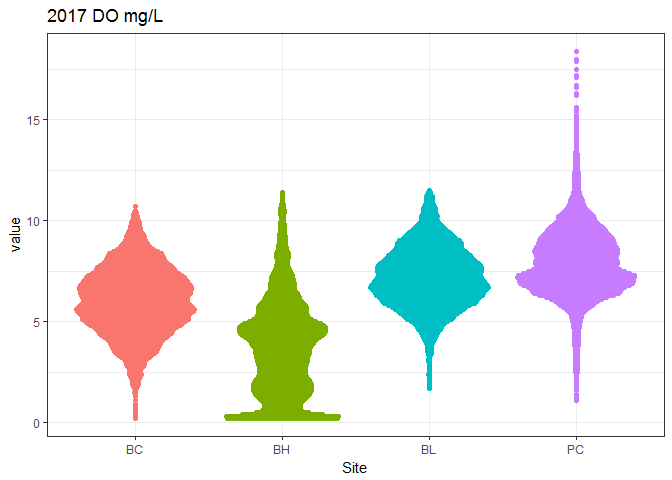
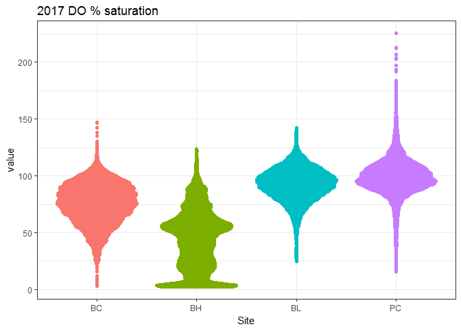
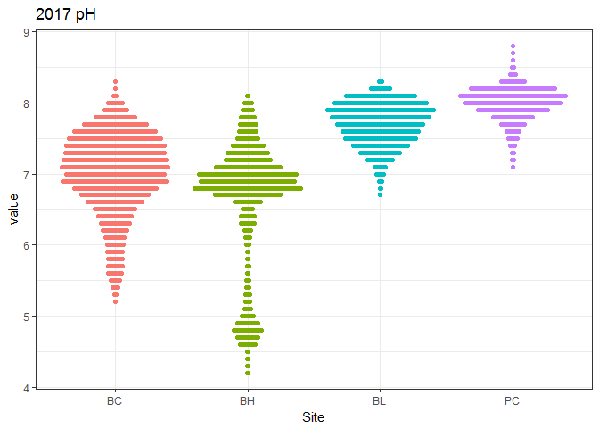

Open up some libraries:


```r
library(SWMPr)  # for easy import and QC of SWMP data
library(tidyverse)  # for lots of data manipulation functions
library(ggbeeswarm)  # for cool plotting
library(knitr)  # for pretty tables
```


# Bring in the data  


```r
# look for data here
datapath <- "C:/Users/kimberly.cressman/Desktop/Main Docs/Data-latest"

# import data
dat_bl <- import_local(datapath, "gndblwq2017") %>%
    qaqc(qaqc_keep = c(0, 1, 5)) %>%
    select(-level, -clevel, -chlfluor)

dat_bh <- import_local(datapath, "gndbhwq2017") %>%
    qaqc(qaqc_keep = c(0, 1, 5)) %>%
    select(-level, -clevel, -chlfluor)

dat_bc <- import_local(datapath, "gndbcwq2017") %>%
    qaqc(qaqc_keep = c(0, 1, 5)) %>%
    select(-level, -clevel, -chlfluor)

dat_pc <- import_local(datapath, "gndpcwq2017") %>%
    qaqc(qaqc_keep = c(0, 1, 5)) %>%
    select(-level, -clevel, -chlfluor)
```

<br>

Next, I want to get all of the salinities into a single data frame, with the site name as the column name, so I can easily put them all on a plot and color by site. Surely there's a better way, but here's what I've gotten to work.


# Functions to extract a single parameter

## Wide Format: param_extract_wide


```r
#' Title
#'
#' @param BC data frame with Bayou Cumbest data. if unspecified, defaults to dat_bc.
#' @param BH data frame with Bayou Heron data
#' @param BL data frame with Bangs Lake data
#' @param PC data frame with Point aux Chenes data
#' @param param put in quotes - param you want to extract. examples: "sal" / "do_mgl"
#'
#' @return returns one wide data frame, with column names being site abbreviations (BC, BH, BL, PC) and values being the parameter of interest
#' @export
#'

param_extract_wide <- function(param, BC = dat_bc, BH = dat_bh, BL = dat_bl, PC = dat_pc) {
    bc <- BC %>%
        select(datetimestamp, !!param) %>%
        rename(BC = !!param)
    bh <- BH %>%
        select(datetimestamp, !!param) %>%
        rename(BH = !!param)
    bl <- BL %>%
        select(datetimestamp, !!param) %>%
        rename(BL = !!param)
    pc <- PC %>%
        select(datetimestamp, !!param) %>%
        rename(PC = !!param)
   
    # glue them all together 
    all <- bc %>%
        left_join(bh) %>%
        left_join(bl) %>%
        left_join(pc)
    
    return(all)
        
}
```


## Long format: param_extract_long


```r
param_extract_long <- function(param, BC = dat_bc, BH = dat_bh, BL = dat_bl, PC = dat_pc) {
    bc <- BC %>%
        select(datetimestamp, !!param) %>%
        rename(BC = !!param)
    bh <- BH %>%
        select(datetimestamp, !!param) %>%
        rename(BH = !!param)
    bl <- BL %>%
        select(datetimestamp, !!param) %>%
        rename(BL = !!param)
    pc <- PC %>%
        select(datetimestamp, !!param) %>%
        rename(PC = !!param)
   
    # glue them all together and gather into a long format 
    all <- bc %>%
        left_join(bh) %>%
        left_join(bl) %>%
        left_join(pc) %>%
        gather(key = "site", value = "value", -datetimestamp)
    
    return(all)
        
}
```


# Extract some parameters


```r
sal_long <- param_extract_long("sal")
head(sal_long)
```

```
##         datetimestamp site value
## 1 2017-01-01 00:00:00   BC  26.1
## 2 2017-01-01 00:15:00   BC  26.9
## 3 2017-01-01 00:30:00   BC  26.4
## 4 2017-01-01 00:45:00   BC  26.4
## 5 2017-01-01 01:00:00   BC  26.7
## 6 2017-01-01 01:15:00   BC  23.4
```

```r
tail(sal_long)
```

```
##              datetimestamp site value
## 140155 2017-12-31 22:30:00   PC  25.4
## 140156 2017-12-31 22:45:00   PC  25.4
## 140157 2017-12-31 23:00:00   PC  25.4
## 140158 2017-12-31 23:15:00   PC  25.3
## 140159 2017-12-31 23:30:00   PC  25.2
## 140160 2017-12-31 23:45:00   PC  25.2
```

```r
domgl_long <- param_extract_long("do_mgl")
head(domgl_long)
```

```
##         datetimestamp site value
## 1 2017-01-01 00:00:00   BC   8.6
## 2 2017-01-01 00:15:00   BC   8.6
## 3 2017-01-01 00:30:00   BC   8.5
## 4 2017-01-01 00:45:00   BC   8.4
## 5 2017-01-01 01:00:00   BC   8.5
## 6 2017-01-01 01:15:00   BC   8.6
```

```r
tail(domgl_long)
```

```
##              datetimestamp site value
## 140155 2017-12-31 22:30:00   PC   9.5
## 140156 2017-12-31 22:45:00   PC   9.5
## 140157 2017-12-31 23:00:00   PC   9.5
## 140158 2017-12-31 23:15:00   PC   9.5
## 140159 2017-12-31 23:30:00   PC   9.5
## 140160 2017-12-31 23:45:00   PC   9.5
```

```r
dopct_long <- param_extract_long("do_pct")
head(dopct_long)
```

```
##         datetimestamp site value
## 1 2017-01-01 00:00:00   BC 100.5
## 2 2017-01-01 00:15:00   BC 100.2
## 3 2017-01-01 00:30:00   BC  99.7
## 4 2017-01-01 00:45:00   BC  98.8
## 5 2017-01-01 01:00:00   BC  99.2
## 6 2017-01-01 01:15:00   BC  99.0
```

```r
tail(dopct_long)
```

```
##              datetimestamp site value
## 140155 2017-12-31 22:30:00   PC  99.5
## 140156 2017-12-31 22:45:00   PC  99.3
## 140157 2017-12-31 23:00:00   PC  99.2
## 140158 2017-12-31 23:15:00   PC  99.0
## 140159 2017-12-31 23:30:00   PC  98.8
## 140160 2017-12-31 23:45:00   PC  98.6
```

```r
ph_long <- param_extract_long("ph")
head(ph_long)
```

```
##         datetimestamp site value
## 1 2017-01-01 00:00:00   BC   8.1
## 2 2017-01-01 00:15:00   BC   8.1
## 3 2017-01-01 00:30:00   BC   8.1
## 4 2017-01-01 00:45:00   BC   8.1
## 5 2017-01-01 01:00:00   BC   8.1
## 6 2017-01-01 01:15:00   BC   8.0
```

```r
tail(ph_long)
```

```
##              datetimestamp site value
## 140155 2017-12-31 22:30:00   PC   8.2
## 140156 2017-12-31 22:45:00   PC   8.2
## 140157 2017-12-31 23:00:00   PC   8.2
## 140158 2017-12-31 23:15:00   PC   8.2
## 140159 2017-12-31 23:30:00   PC   8.2
## 140160 2017-12-31 23:45:00   PC   8.2
```


<br>

# Make plots


```r
beeswarm_wq <- function(dat, title = "", xlab = "Site", ylab = "value") {
    p <- ggplot(dat) +
        geom_quasirandom(aes(x = site, y = value, color = site), 
                         na.rm = TRUE, # ignore missing data
                         show.legend = FALSE) +  # don't need a legend for colors by site
        labs(title = title, 
             x = xlab, 
             y = ylab) +
        theme_bw()
    
    print(p)
}
```


## Salinity


```r
beeswarm_wq(sal_long, title = "2017 Salinity")
```

<!-- -->


## DO mg/L


```r
beeswarm_wq(domgl_long, title = "2017 DO mg/L")
```

<!-- -->

## DO % saturation


```r
beeswarm_wq(dopct_long, title = "2017 DO % saturation")
```

<!-- -->

## pH


```r
beeswarm_wq(ph_long, title = "2017 pH")
```

<!-- -->


