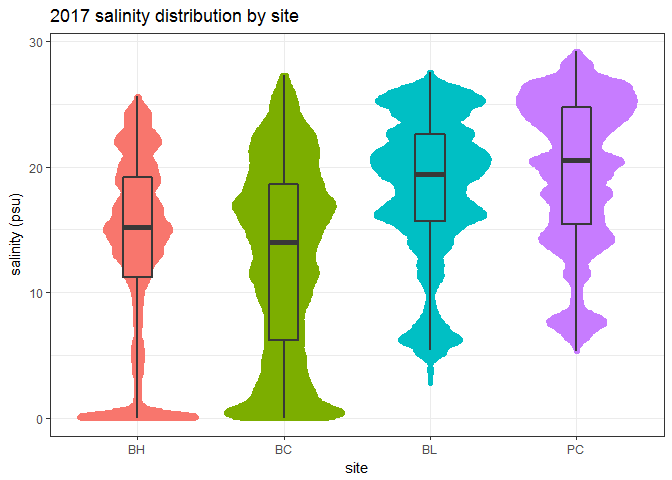

<br>

What I'm doing for this Plot of the Month is making a _beeswarm plot_. It's really cool - like a cross between a box plot and a histogram, but way more fun, because you get interesting shapes. There's a point on the graph for every measurement; and where the blob is wider, there are more readings of that particular value. Seems like a perfect way to visualize salinity data.  

__Some credit for this idea goes to others:__  These plots were inspired by #TidyTuesday on Twitter - those of you looking for more frequent "assignments" to practice your R and data visualization skills should check it out. More info here: https://github.com/rfordatascience/tidytuesday  

<br>

So here we go....


# Bring in the data  


Open up some libraries:


```r
library(SWMPr)  # for easy import and QC of SWMP data
library(tidyverse)  # for lots of data manipulation functions
library(ggbeeswarm)  # for cool plotting
library(knitr)  # for pretty tables
```

  

## Important Functions and Packages  


1.  I'm using `SWMPr::import_local` to pull in and qaqc my data files.  
    +  This function works best on zip files downloaded from the CDMO's Advanced Query System: http://cdmo.baruch.sc.edu/aqs/. I do a big download every year and keep it all in a folder I call "Data-latest" (you'll see that in my code below).  
    +  You can import all files from a site by only specifying the site name, without a year. I only care about 2017 here, but if I wanted all the data, I'd just say `import_local(datapath, "gndblwq")`. 
    +  The default behavior for the `qaqc()` function is to only keep data with (0) flags. I like to keep suspect (1) and corrected (5) data too, so I've specified all three using `qaqc_keep()`. 
2.  The `select` function from `dplyr` lets me pick and choose by column name. I'm using a "-" in front of column names that represent columns I don't want: select everything MINUS these columns. If I only wanted to keep a column or two, it would read `select(datetimestamp, sal)` and be a smaller data frame.  
3.  The pipe function, `%>%`, lets me do multiple things at once. I think of it like __*"and then"*__ - so these lines of code say:  
    +  "import this data file, __*and then*__  
    +  run the qaqc step on it, __*and then*__  
    +  remove the columns that I don't want." 


```r
# look for data here
datapath <- "C:/Users/kimberly.cressman/Desktop/Main Docs/Data-latest"

# import data
dat_bl <- import_local(datapath, "gndblwq2017") %>%
    qaqc(qaqc_keep = c(0, 1, 5)) %>%
    select(-level, -clevel, -chlfluor)

dat_bh <- import_local(datapath, "gndbhwq2017") %>%
    qaqc(qaqc_keep = c(0, 1, 5)) %>%
    select(-level, -clevel, -chlfluor)

dat_bc <- import_local(datapath, "gndbcwq2017") %>%
    qaqc(qaqc_keep = c(0, 1, 5)) %>%
    select(-level, -clevel, -chlfluor)

dat_pc <- import_local(datapath, "gndpcwq2017") %>%
    qaqc(qaqc_keep = c(0, 1, 5)) %>%
    select(-level, -clevel, -chlfluor)
```


## Data Shaping  


Next, I want to get all of the salinities into a single data frame, with the site name as the column name, so I can easily put them all on a plot and color by site. Surely there's a better way, but here's what I've gotten to work.


I'm reading the code in my head like this: 

+  "bl_sal is what I want out of this.  
+  Start with dat_bl, __*and then:*__  
+  select the datetimestamp and sal columns, __*and then:*__  
+  rename the sal column to be BL." 


```r
bl_sal <- dat_bl %>%
    select(datetimestamp, sal) %>%
    rename(BL = sal)
```

<br>

See what I mean about the pipe letting you string a bunch of commands together easily?

And I'm just doing that for each site.

<br>


```r
bh_sal <- dat_bh %>%
    select(datetimestamp, sal) %>%
    rename(BH = sal)

bc_sal <- dat_bc %>%
    select(datetimestamp, sal) %>%
    rename(BC = sal)

pc_sal <- dat_pc %>%
    select(datetimestamp, sal) %>%
    rename(PC = sal)
```


<br>

Now I'm going to glue them all together, adding one at a time through `dplyr`'s `left_join` function. Read this as:  

+  "all_sal will be the output. Take bl_sal, __*and then*__   
+  left_join bh_sal to it; __*and then*__  
+  left_join bc_sal to that; __*and then*__  
+  left_join pc_sal."   


```r
all_sal <- bl_sal %>%
    left_join(bh_sal) %>%
    left_join(bc_sal) %>%
    left_join(pc_sal) 
```

<br>

Here's the head of the data frame - need to make sure this worked! I got a little worried when I saw all NAs at the top of BL's list, but then I remembered the sonde's batteries died in December 2016. So this isn't actually a problem with anything I've done in R.


```r
head(all_sal, 10)
```

```
##          datetimestamp BL   BH   BC   PC
## 1  2017-01-01 00:00:00 NA 21.8 26.1 27.3
## 2  2017-01-01 00:15:00 NA 21.2 26.9 27.3
## 3  2017-01-01 00:30:00 NA 20.1 26.4 27.4
## 4  2017-01-01 00:45:00 NA 20.6 26.4 27.5
## 5  2017-01-01 01:00:00 NA 20.4 26.7 27.4
## 6  2017-01-01 01:15:00 NA 20.5 23.4 27.3
## 7  2017-01-01 01:30:00 NA 20.6 22.9 27.3
## 8  2017-01-01 01:45:00 NA 20.0 23.7 27.2
## 9  2017-01-01 02:00:00 NA 19.7 21.4 27.1
## 10 2017-01-01 02:15:00 NA 14.9 21.4 27.0
```

<br>

Above is what you'd see in your console in R. What I'll do for the rest of this post is make the tables pretty using the `kable` function from the `knitr` package. If you're not making html files with your code, don't worry about `kable`; just do the normal `head(dataframe)` thing. Here's how the same information looks different:

<br>


```r
kable(head(all_sal, 10), align = "c", caption = "first 10 salinity readings of 2017 for each site")
```


Table: first 10 salinity readings of 2017 for each site

    datetimestamp       BL     BH      BC      PC  
---------------------  ----  ------  ------  ------
 2017-01-01 00:00:00    NA    21.8    26.1    27.3 
 2017-01-01 00:15:00    NA    21.2    26.9    27.3 
 2017-01-01 00:30:00    NA    20.1    26.4    27.4 
 2017-01-01 00:45:00    NA    20.6    26.4    27.5 
 2017-01-01 01:00:00    NA    20.4    26.7    27.4 
 2017-01-01 01:15:00    NA    20.5    23.4    27.3 
 2017-01-01 01:30:00    NA    20.6    22.9    27.3 
 2017-01-01 01:45:00    NA    20.0    23.7    27.2 
 2017-01-01 02:00:00    NA    19.7    21.4    27.1 
 2017-01-01 02:15:00    NA    14.9    21.4    27.0 

<br>

Just a little more reshaping to do; for easy grouping in ggplot, we need data in a long format. This is pretty easy using the `dplyr` package's `gather` function. 


I'm also throwing in a `mutate` line with `fct_relevel` (from the `forcats` package) because R automatically places my sites in alphabetical order, but I want them in order of __highest to lowest freshwater input__. This matters for their arrangement on the plots.

<br>


```r
all_sal_long <- all_sal %>%
    gather(key = "site", value = "sal", -datetimestamp) %>%
    mutate(site = factor(site),
           site = fct_relevel(site, "BH", "BC", "BL", "PC"))

kable(head(all_sal_long), align = "c")
```

    datetimestamp       site    sal 
---------------------  ------  -----
 2017-01-01 00:00:00     BL     NA  
 2017-01-01 00:15:00     BL     NA  
 2017-01-01 00:30:00     BL     NA  
 2017-01-01 00:45:00     BL     NA  
 2017-01-01 01:00:00     BL     NA  
 2017-01-01 01:15:00     BL     NA  

```r
kable(tail(all_sal_long), align = "c")
```

             datetimestamp       site    sal  
-------  ---------------------  ------  ------
140155    2017-12-31 22:30:00     PC     25.4 
140156    2017-12-31 22:45:00     PC     25.4 
140157    2017-12-31 23:00:00     PC     25.4 
140158    2017-12-31 23:15:00     PC     25.3 
140159    2017-12-31 23:30:00     PC     25.2 
140160    2017-12-31 23:45:00     PC     25.2 


# Plot it!  

## Main Plot  


This plot was made with the `geom_quasirandom` function from the `ggbeeswarm` package. This package plays nicely with `ggplot2`, which is my favorite package for making complicated graphs.  

<br>


```r
ggplot(all_sal_long) +
    geom_quasirandom(aes(x = site, y = sal, color = site), 
                     na.rm = TRUE, # ignore missing data
                     show.legend = FALSE) +  # don't need a legend for colors by site
    labs(title = "2017 salinity distribution by site", 
         x = "site", 
         y = "salinity (psu)") +
    theme_bw()
```

<!-- -->

<br>

### Beeswarm with boxplot overlay  


Here's the same plot with a boxplot on top of it, so you can see how they compare. Boxplots are useful summaries, but it turns out you also miss quite a lot.

<br>


```r
ggplot(all_sal_long) +
    geom_quasirandom(aes(x = site, y = sal, color = site), 
                     na.rm = TRUE, # ignore missing data
                     show.legend = FALSE) +  # don't need a legend for colors by site
    geom_boxplot(aes(x = site, y = sal), alpha = 0, size = 1, width = 0.2, color = "gray22") +
    labs(title = "2017 salinity distribution by site", 
         x = "site", 
         y = "salinity (psu)") +
    theme_bw()
```

<!-- -->

<br>

__These swarms look pretty solid. We do have 35,000+ measurements from each site, after all.__ If you had a smaller dataset, you could play around with the size and shape of the points to get a different look.  

<br>

## Plotting a smaller subset  


For an example, I'll pull out data from the first week of April 2017. The `filter` function comes from the `dplyr` package, and lets you specify conditions for rows you want to keep. Remember, if you need more detail on a function, you can type `?filter` (or whatever the function is) into the console, and it will pull up the help file.


```r
april_sal <- all_sal_long %>%
    filter(datetimestamp >= "2017-04-01 0:00",
           datetimestamp <= "2017-04-07 23:45")
```

<br>

### Default Plot Settings  


Here's the plot with default settings. 

<br>


```r
ggplot(april_sal) +
    geom_quasirandom(aes(x = site, y = sal, color = site), 
                     na.rm = TRUE, # ignore missing data
                     show.legend = FALSE) +  # don't need a legend for colors by site
    labs(title = "April 1-7, 2017 salinity distribution by site", 
         x = "site", 
         y = "salinity (psu)") +
    theme_bw()
```

<!-- -->

<br>

### Changing point size  


Here it is again, specifying `size = 0.5`. This produces smaller points, and a bit of whitespace:

<br>


```r
ggplot(april_sal) +
    geom_quasirandom(aes(x = site, y = sal, color = site), 
                     size = 0.5,
                     na.rm = TRUE, # ignore missing data
                     show.legend = FALSE) +  # don't need a legend for colors by site
    labs(title = "April 1-7, 2017 salinity distribution by site", 
         x = "site", 
         y = "salinity (psu)") +
    theme_bw()
```

<!-- -->

<br>

### Changing point size and shape  


Here, I'll go up to a bigger point size, and specify a different shape (see  http://www.sthda.com/english/wiki/ggplot2-point-shapes for shapes to choose from):

<br>


```r
ggplot(april_sal) +
    geom_quasirandom(aes(x = site, y = sal, color = site), 
                     size = 2,
                     shape = 0,
                     na.rm = TRUE, # ignore missing data
                     show.legend = FALSE) +  # don't need a legend for colors by site
    labs(title = "April 1-7, 2017 salinity distribution by site", 
         x = "site", 
         y = "salinity (psu)") +
    theme_bw()
```

<!-- -->

<br>

# Some things left for the future


Of course I don't want to stop here - I want to make one of these for every parameter. And every year. (I've already done a few, and the drought year plots look quite different). And then I want to make animations of a parameter through the years! There are ways. But that's best left for some time in the future when I have a bit more time to play.  


I hope you've found this interesting and helpful. __If you recreate it with data from your Reserve, please post the results in the SWMPrats forum!__

<br>


